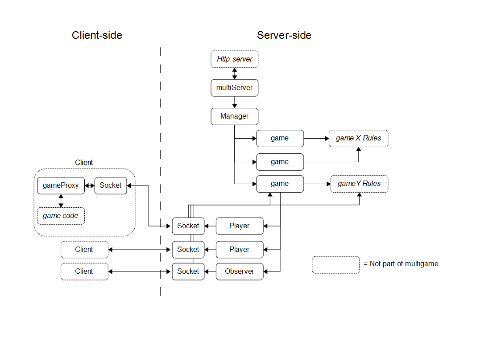

multigame
=========

Multigame is a library, or perhaps more of a platform, to help you manage and build JavaScript multiplayer games. It takes care of connecting players and viewers (=spectators) to games and handles the communication between them. It runs on node.js.

There is a __server part__ and a __client part__ of the library. The client part exposes an object that acts a bit like a proxy for the game that runs on the server, that the client is connected to.

A multigame server can handle many games instances, of different game types, simultaneously. The WebSocket protocol is used to communicate between server and clients.

Games must be built using the platform to be able to be hosted on a multigame server.

Overview
--------


Install
-------
On the server:
```js
npm install multigame --save
```
and in the client code:
```html
<script src="/socket.io/socket.io.js"></script>
<script src="<your directory>/gameProxy.js"></script>
```

Usage
-----

###Writing a game
When writing a game, using this platform, you create a server object, called a Rules object. It should contain game logic and adhere to the interface specified in the platform's Rules module. You should only need one Rules object for all your game instances (if they are of the same type that is). A Rule object should be stateless.

You will need a client part of your game too. The client part has access to a game proxy object, that is part of the platform, which takes care of the communication with the server. You decide where you want to put the game logic, server and/or client side.

A Game and a Player object have a property called 'state'. It is empty from the start. A Game's 'state' is what is sent to all who are connected to a Game when there has been an update to the state. If the client is a player it will also receive the state of the player object, that resides on the server and is associated with the client/socket.

You yourself fill the state properties with whatever that is relevant for your game. You can also add whatever you need to a Game or Player object (properties and methods), just remember that it is the 'state'-properties that are sent to clients.

A game that uses the platform is [Tricker](https://github.com/Kajja/tricker).

###Setting up a multigame server
```js
var http = require('http');

// Get the multigame server "factory" function
var GameServer = require('multigame').Server;

// Get the verifyer object
var verifyer = require('multigame').verifyer;

// Create a HTTP server
var server = http.createServer(app);
server.listen(port);

// Register domains from which connections should be accepted
verifyer.registerDomain('localhost:3000');

// Create a new multigame server using the "factory" function
var multiServer = GameServer(server, verifyer);
```

###Setting up a new game

```js
// Get the Manager "singleton"
var Manager = require('multigame').Manager;

// Get the Game constructor function
var Game = require('multigame').Game;

// Get a Rules object for the type of game you want to create
var TrickerRules = require('tricker').Rules;

// Create a new game and register it with the Manager object
Manager.registerGame(new Game({id: 1, name: 'The dungeon', rules: TrickerRules}));
```

###Creating a player for a game
```js
// Get the Player constructor function
var Player = require('multigame').Player;

// Create a Player object
var player = new Player(socket);

// Register the Player object with the game
game.registerObserver(player);
```
You might want to add additional properties and methods to the Player object.


###Retrieving a specific game
```js
// Get the Manager "singleton"
var Manager = require('multigame').Manager;

var game = Manager.getGame(id);
```

###Connect to a game
In the client code, you first need to register an object as an observer to the GameProxy object to receive server updates. The GameProxy object expects the object to have an update(state) method that it can call.

```js
// Register the tricker client as an observer to GameProxy events
GameProxy.registerObserver(TrickerClient);
```
Then you can connect to a game on the server:
```js
// Connecting to a game
GameProxy.connect(url, gameId, clientType);
```

Protocol between server and client
----------------------------------
###Client generated events

* connection          
* disconnect          
* error (data: error)           
* game_connect (data: game id)
* add_player
* add_observer
* msg (data: game specific event data)

###Server generated events

* connect
* connect_error (data: error)
* error (data: error)
* disconnect (data: disconnect reason)
* state (data: game and possibly player state)


TODO
----
These are things that should be addressed:

* Remove socket.io dependency
* Be able to connect to a db for players/observers (?!)
* A better way to handle game and player states